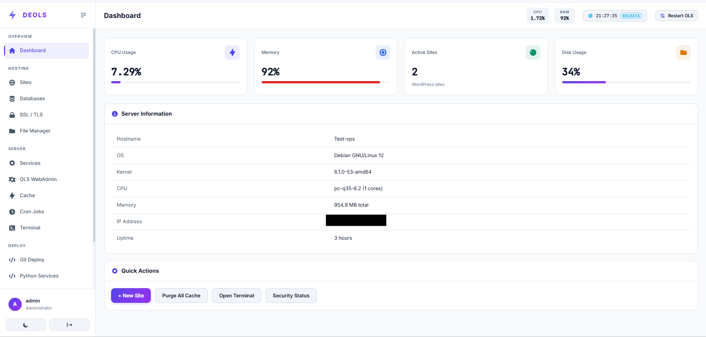

# ⚡ DEOLS — Debian OpenLiteSpeed Server Panel

<p align="center">
  <strong>Ultra-lightweight, zero-bloat server management panel built specifically for Debian 12 (Bookworm) & OpenLiteSpeed.</strong><br>
  <em>Designed for WordPress at scale, automated SSL, custom background services, and effortless server administration.</em>
</p>

<p align="center">
  
</p>

<p align="center">
  <a href="#-quick-installation"></a>
  <a href="#-tech-stack--system-requirements"></a>
  <a href="#-tech-stack--system-requirements"></a>
  <a href="#-tech-stack--system-requirements"></a>
  <a href="LICENSE"></a>
</p>

---

## 📑 Table of Contents

- [🌟 Why Choose DEOLS?](#-why-choose-deols)
- [🚀 Quick Installation](#-quick-installation)
- [🔑 First-Time Login & Admin Reset](#-first-time-login--admin-reset)
- [✨ Key Features at a Glance](#-key-features-at-a-glance)
  - [1. WordPress & Site Engine](#1-wordpress--site-engine)
  - [2. MariaDB Database Management](#2-mariadb-database-management)
  - [3. SSL & Wildcard Certificate Manager](#3-ssl--wildcard-certificate-manager)
  - [4. Built-in Web Terminal](#4-built-in-web-terminal)
  - [5. Cache & Performance Control](#5-cache--performance-control)
  - [6. File Manager & Permissions](#6-file-manager--permissions)
  - [7. Python Services & Background Daemons](#7-python-services--background-daemons)
  - [8. Security, Firewall & Anti-Attack Mode](#8-security-firewall--anti-attack-mode)
- [💻 Tech Stack & System Requirements](#-tech-stack--system-requirements)
- [🛠️ Useful CLI Commands](#️-useful-cli-commands)
- [🔒 Security Architecture](#-security-architecture)
- [📄 License](#-license)

---

## 🌟 Why Choose DEOLS?

Most traditional control panels (cPanel, Plesk, aaPanel, CyberPanel) are heavy, run dozens of redundant background daemons, consume 1GB+ of idle RAM, and bundle outdated packages.

**DEOLS is built differently:**

- 🪶 **Sub-50MB Idle Memory**: Ultra-lean Node.js/Fastify daemon and zero-dependency SPA frontend.
- ⚡ **Native OpenLiteSpeed + LSPHP 8.3**: Blazing fast event-driven HTTP/3 web server with native LSCache acceleration.
- 🎯 **No Vendor Lock-In**: Standard Debian 12 packages, native Systemd units, and clean OpenLiteSpeed virtual host templates.
- 🛡️ **Zero Public Web Registration**: Admin credentials are generated exclusively from your VPS root terminal using Argon2id encryption.
- 🔧 **Automated WP-CLI Provisioning**: One-click WordPress installation with automatic database generation, custom admin credentials, and permission handling (`nobody:nogroup`).

---

## 🚀 Quick Installation

Run this one-line command as **`root`** on a fresh **Debian 12 (Bookworm)** server:

```bash
curl -sSL https://raw.githubusercontent.com/mimi566/DEOLS/main/install.sh | bash
```

### Manual Installation via Git:

```bash
git clone https://github.com/mimi566/DEOLS.git /opt/deols
cd /opt/deols
bash install.sh
```

The installer automatically configures:
- OpenLiteSpeed Web Server (`lsws`) & LSPHP 8.3 / 8.2
- MariaDB 10.11+ Database Engine
- Redis Server & Memcached Cache
- WP-CLI, Certbot & Cloudflare DNS plugin
- UFW Firewall & Fail2ban security jails
- DEOLS Systemd daemon on port `8443`

---

## 🔑 First-Time Login & Admin Reset

For maximum security, DEOLS does not have an open web registration form. To generate or reset your administrator password, run this command on your VPS via SSH:

```bash
deols admin reset
```

The command will generate your login credentials:
- **URL**: `http://YOUR_SERVER_IP:8443` (or `https://YOUR_SERVER_IP:8443`)
- **Username**: `admin`
- **Password**: `[Generated Secure Password]`

---

## ✨ Key Features at a Glance

### 1. WordPress & Site Engine
- **Automated Provisioning**: Creates OLS Virtual Host, docroot, database, DB user, downloads core, and runs automated `wp core install` in seconds.
- **Custom Credentials**: Set your custom WordPress admin username, email, password, and site title on creation.
- **Wildcard Subdomain Support**: Easily configure `*.yourdomain.com` with catch-all routing.
- **Single-Click Utilities**: One-click permission repair (`nobody:nogroup`), WordPress cache purges, and automated WP-Cron execution.

### 2. MariaDB Database Management
- **All-in-One Creation**: Create database, user, password, and grant full privileges (`FLUSH PRIVILEGES`) in a single step.
- **Auto-Sync with `wp-config.php`**: Changing a database password through DEOLS automatically updates your site's `wp-config.php` configuration.
- **Auto-Repair & Optimize**: Run `mysqlcheck` repair routines and fix connection mismatches with a single click.

### 3. SSL & Wildcard Certificate Manager
- **Let's Encrypt Automated SSL**: Issue free SSL certificates with automatic renewal hooks for OpenLiteSpeed.
- **Cloudflare DNS Wildcard SSL**: Issue `*.domain.com` wildcard certificates via Cloudflare DNS API tokens.
- **Coverage Status**: Instant visibility over domain coverage, SAN extensions, and expiration dates.

### 4. Built-in Web Terminal
- **Interactive Server Shell**: Execute server commands directly from the browser with root privileges.
- **Command History**: Navigate previous commands with Up/Down arrow keys.
- **Safe Environment**: Pre-configured system `PATH` and non-blocking streaming output.

### 5. Cache & Performance Control
- **OLS Full-Page Cache**: Purge per-site or global OpenLiteSpeed cache instantly.
- **Redis & Memcached Management**: View memory utilization, start/stop services, and flush keys directly from the panel.

### 6. File Manager & Permissions
- **File Explorer**: Browse, create, edit, upload, delete, and extract `.zip` / `.tar.gz` archives in web roots.
- **Permission Fixer**: Recursively fixes `755` for directories and `644` for files under `nobody:nogroup`.

### 7. Python Services & Background Daemons
- **Isolated Virtual Environments**: Deploy Python scripts with automatic `venv` setup and `requirements.txt` installation.
- **Systemd Integration**: Manages Python services as standard Linux background daemons with live log inspection.

### 8. Security, Firewall & Anti-Attack Mode
- **UFW Rule Manager**: Open and close server ports (HTTP, HTTPS, SSH, MySQL, Custom Ports) visually.
- **Fail2ban Jails**: Protect against brute-force attacks on SSH, OpenLiteSpeed WebAdmin, and WordPress login endpoints.
- **🛡️ Single-Button Anti-Attack Mode**: Lock down server under DDoS by blocking XML-RPC, enforcing strict OLS per-IP rate limits, and tightening Fail2ban triggers.

---

## 💻 Tech Stack & System Requirements

| Component | Specification |
|---|---|
| **Operating System** | Debian 12 (Bookworm) 64-bit |
| **Minimum Hardware** | 1 vCPU / 1 GB RAM / 10 GB Disk |
| **Web Server** | OpenLiteSpeed 1.8+ |
| **PHP Engine** | LSPHP 8.3 / LSPHP 8.2 with OPcache |
| **Database Server** | MariaDB 10.11+ |
| **Caching Layer** | Redis 7+ / Memcached |
| **Panel Architecture** | Node.js 20+ LTS, Fastify, Vanilla JS SPA |

---

## 🛠️ Useful CLI Commands

DEOLS includes a convenient command-line tool accessible directly from root SSH:

```bash
# Reset or generate new admin credentials
deols admin reset

# Check status of the DEOLS daemon
systemctl status deols

# Restart DEOLS panel
systemctl restart deols

# Restart OpenLiteSpeed web server
systemctl restart lsws

# View live panel daemon logs
journalctl -u deols -f
```

---

## 🔒 Security Architecture

- **Argon2id Password Hashing**: Next-generation cryptographic password derivation.
- **Stateless JWT Tokens**: Signed JSON Web Tokens with rate-limited API protection.
- **Principle of Least Privilege**: OpenLiteSpeed processes run under dedicated unprivileged `nobody:nogroup`.
- **Zero Exposure**: No remote root registration vectors and fully sanitized input validation on all shell & SQL handlers.

---

## 📄 License

DEOLS is open-source software licensed under the [MIT License](LICENSE). Free to use, modify, and distribute for personal and commercial servers.
